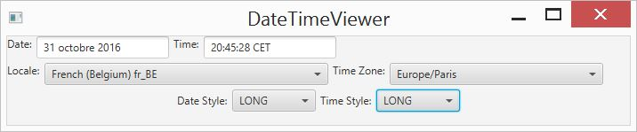

# COP2805C Module 8 Practice Exercise

Design and implement a JavaFX application named "DateTimeViewer" which displays the current date and time (digitally) using the selected locale, timezone, date format, and time format as shown below.

(HINT: this application uses 4 combo boxes).

